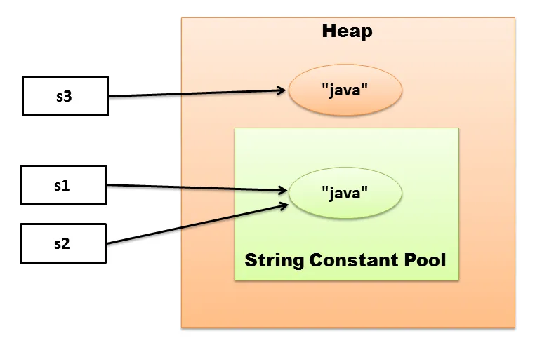

# 1.4

## Object

* Предок всех классов Java.

* `public boolean equals(Object obj)` - метод для проверки эквивалентности между объектами.
Обязательно делать его переопределение согласно сигнатуре метода класса `Object`

* `pubic String toString()` - метод для получения строкового представления объекта.

## String

* Immutable-класс - `final`, нет методов для изменения содержимого (безопасность, многопоточная среда, StringPool)

* Сравниваем всегда через `equals`

* Есть интересный `intern()`

## Wrappers

* Классы обертки, нужны для того, чтобы их использовать в generics + служебные методы.

* Используют механизм автоматической упаковки и распаковки.

* Некоторые типы содержат механизмы кеширования.

## Comparator/Comparable

* Интерфейсы для реализации логики сравнения в самом классе (`Comparable`) и логики сравнения вне класса (`Comparator`).
