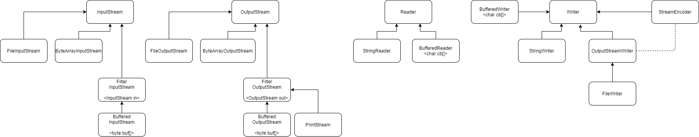

# 1.6



## Работа с Java IO

* Byte I/O

* Character I/O

* Форматированный I/O

* Буферизированный I/O

* Object I/O

## Байты

### InputStream

* Абстрактный класс, который содержит общую логику работы с потоками байтов.

#### read()

* Метод для чтения одного байта из входного потока байтов, возвращает `int`, а не `byte`, потому
что байт в Java - знаковый тип, и значению 255 соответствует -1, а нам нужно получать информацию о том, что
поток байтов кончился (значение -1). Чтобы не было неоднозначности, возвращается `int`.

* Данный метод будет реализован в потомках, которые специфицируют поведение этого метода относительно 
типа входного потока (массив, файл и т.д.).

```
public abstract int read() throws IOException;
```

#### read(byte buf[], int off, int len)

* Метод получения массива байтов из входного потока.

* Уже реализован в `InputStream`, базируется на логике метода `read()` для чтения одного байта.

* Потомки могут изменить реализацию для ускорения работы.

```
public int read(byte b[], int off, int len)
```

### ByteArrayInputStream

* Потомок `InputStream`, который работает с потоком байтов на основе байтового массива.

### FileInputStream

* Потомок `InputSteam`, который работает с потоком байтов из файла.

### FilterInputStream

* Декоратор для `InputStream`, для того, чтобы можно было дописать какую-либо логику у `InputStream`.

### BufferedInputStream/BufferedOutputStream

* Классы, содержащие в качестве поля массив байтов. Таким образом, позволяют не обращаться при каждом чтении/записи
непосредственно к ресурсу, а работать с буфером.

## Символы

* `Reader`, `Writer` - классы для работы с потоком символов.

## Форматированный ввод/вывод

* `Scanner` - возвращает данные в нужном типе.