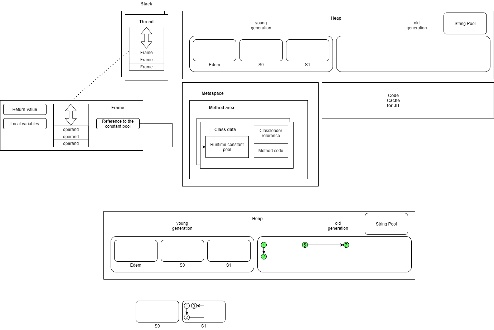

# 1.11

## JVM, GC, JIT

* Heap - куча. Хранит объекты, на которые ссылаются переменные.

* `Young Gen` - область для "маленьких" маложивущих объектов. Делится на Eden - область для вновь созданных объектов, 
S0 и S1 - области для хранения "выживших". Периодически объекты отсюда попадают в `Old Gen` для "долгоживущих" объектов.

* Minor GC - очистка `Young Gen`

* Major GC - очистка `Old Gen`

## JIT

* C1 и C2 - компиляторы JIT. С1 - быстро компилирует, но с малой оптимизацией. C2 - медленно компилирует, но с максимальной
оптимизацией.

* 0 - интерпретируемый код
* 1 - C1 с оптимизацией на старте.
* 2 - С1 с учетом количества вызовов методов.
* 3 - C1 с профилированием.
* 4 - С2

* 0 - 3 - 4 -> происходит интерпретация, сразу включается профилирование, переходим к варианту с супер-оптимизацией.