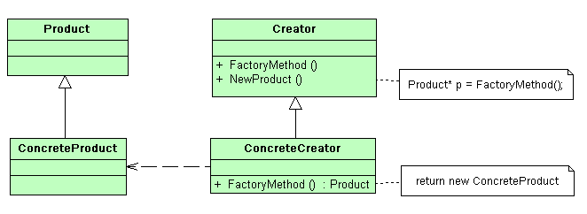
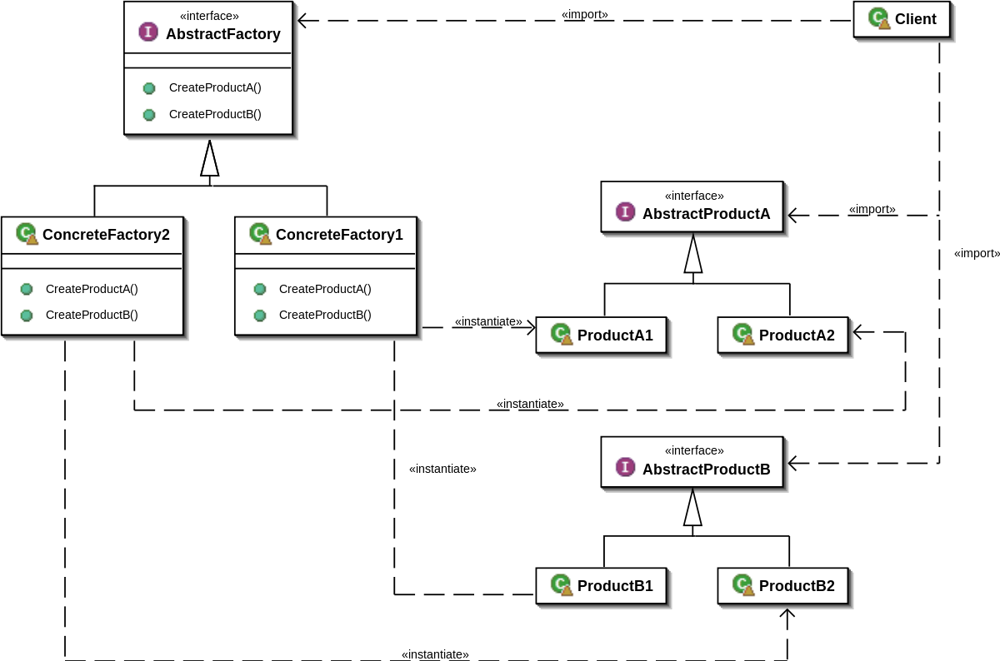
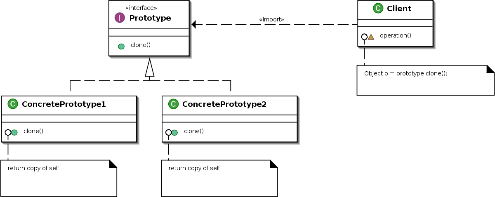

# 2.1

* [Полезная ссылка с паттернами](https://refactoring.guru/ru/design-patterns/creational-patterns)

## Порождающие паттерны проектирования

* Фабричный метод

* Абстрактная фабрика

* Builder - применяется для последовательной и выборочной инициализации объекта.

* Прототип

* Singleton