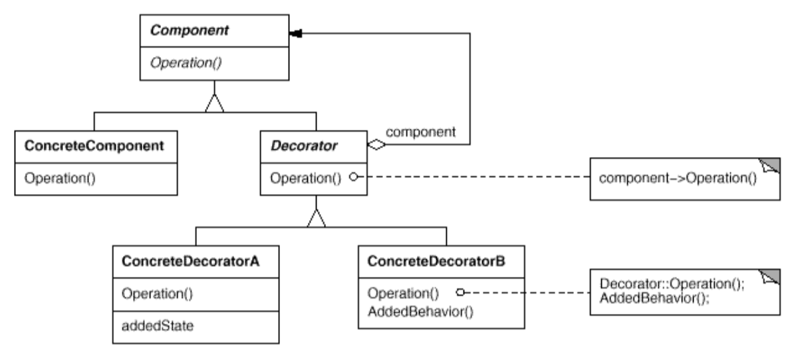

# 2.2

* [Полезная ссылка с паттернами](https://refactoring.guru/ru/design-patterns/structural-patterns)

## Структурные паттерны проектирования

* Адаптер

* Декоратор

* Прокси - замещает исходный объект.

* Фасад

