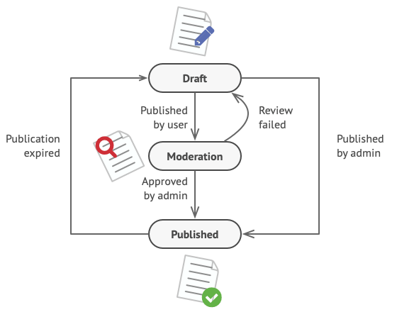
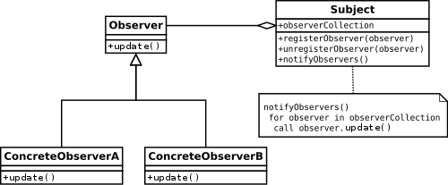
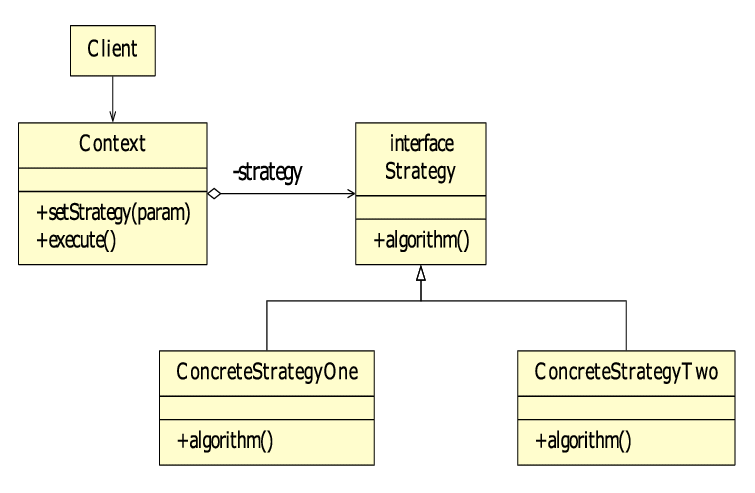

# 2.3

* [Полезная ссылка с паттернами](https://refactoring.guru/ru/design-patterns/behavioral-patterns)

## Поведенческие паттерны проектирования

* Состояние

* Цепочка обязанностей

* Наблюдатель

* Стратегия

