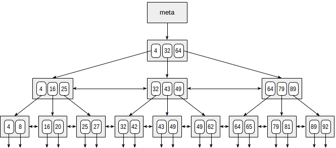

# 3.1 SQL, JDBC

## План запроса

* [О плане запроса](https://habr.com/ru/post/275851/)

* План запроса - строится перед непосредственным выполнением, представляет собой последовательность действий,
которые необходимо выполнить, чтобы получить результат.

`Seq Scan` - последовательный перебор строк по какому-либо правилу.

* Реализация JOIN-ов

```
Hash Join
    Hash Cond 
    -> получение выборки
    -> Hash
        -> получение выборки
```

```
key - id|value
---------
1031    |1031, 2018-08-09 00:00:00.000000,35000
2120    |2120, 2018-09-08 00:00:00.000000,25000
1036    |1036, 2020-09-18 00:00:00.000000,25000

```

* NestedLoop, Bitmap index scan

## Индексы

* Индексы - строятся на основе BTree, позволяют ускорить поиск по каким-либо значениям, но могут замедлить работу 
insert-ов, потому что нужно перестраивать индекс при каждом добавлении.

 

## CTE 

* СTE - временные таблицы, которые улучшают семантику и синтаксис запроса.

## Подготовленные запросы

* Жизненный цикл запроса
- Парсинг
- Анализ
- Построение плана
- Выполнение запроса

* Подготовленные запросы позволяют избежать постоянного парсинга и анализа запроса.
* Если подготовленный запрос вызывается более пяти раз, то postgres считает, что он научился строить 
оптимальный план для этого запроса и больше не будет создавать план для этого запроса.

* Подготовленный запрос "живет одну сессию соединения с БД".

## JDBC

* Технология (стандарт в Java), которая позволяет выстроить взаимодействие между СУБД и Java-приложением.
* Все классы и интерфейсы для работы с базами данных лежат в пакете `java.sql`.

* `Connection` - интерфейс, объекты которого представляют собой подключение к базе данных.
* `Statement` - интерфейс, объекты которого умеют отправлять запросы в базу данных.
* `PreparedStatement` - интерфейс, объекты которого позволяют отправлять подготовленные запросы.
* `ResultSet` - интерфейс, объекты которого представляют собой итераторы по результирующему набору строк.

```
resultSet ->
    32690,2021-06-10 00:00:00.000000
    26803,2112-10-09 00:00:00.000000
    15636,2121-02-21 00:00:00.000000
    
resultSet.next()  

resultSet -> 32690,2021-06-10 00:00:00.000000
             26803,2112-10-09 00:00:00.000000
             15636,2121-02-21 00:00:00.000000  

```

* `SQL-инъекция` - внедрение SQL-кода, который будет выполнен на сервере.
* `Driver` - интерфейс, объекты которого отвечают за логику работы с конкретной СУБД, предоставляет `Connection`
* `DriverManager` - класс, который сканирует JVM на наличие драйверов для СУБД. 
