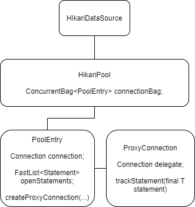

# 3.2 SQL, JDBC, JDBC Repository

## Проблемы с подключениями

1. Если используется конструкция с одним доступным `Connection`, то случается ситуация, при которой поток
работает с открытым соединением, но в процессе оно закрывается другим потоком.
2. Если мы для каждого запроса создаем подключение, то возникает ситуация, когда одновременно много потоков
запрашивает подключение к БД для своих запросов и БД начинает отключаться.
3. Единственное решение - все запросы складывать в какую-то очередь или список (сразу не выполнять), но при этом
держать какой-то пул соединений в ограниченном количестве, при этом каждый новый запрос направлять в свободное
соединение.

 