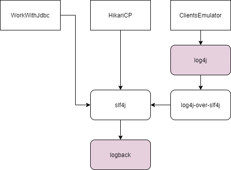

# 4.3 

 

## Логирование

* Logger - источник логов (например, класс).
* Appender - записывает логи.
* Layout - определяет формат логов.

## Уровни логирования

* OFF - ничего не логируется
* FATAL - ошибки, которые, например, приводят к падению виртуальной машины.
* ERROR - ошибка, которая не приводит к падению всей системы, но требует внимание.
* WARN - предупреждение.
* INFO - какие-либо важные сообщения системы.
* DEBUG - уровень логирования для отладки.
* TRACE - тоже для отладки, но с меньшей значимостью.
* ALL - действительно "все подряд"
