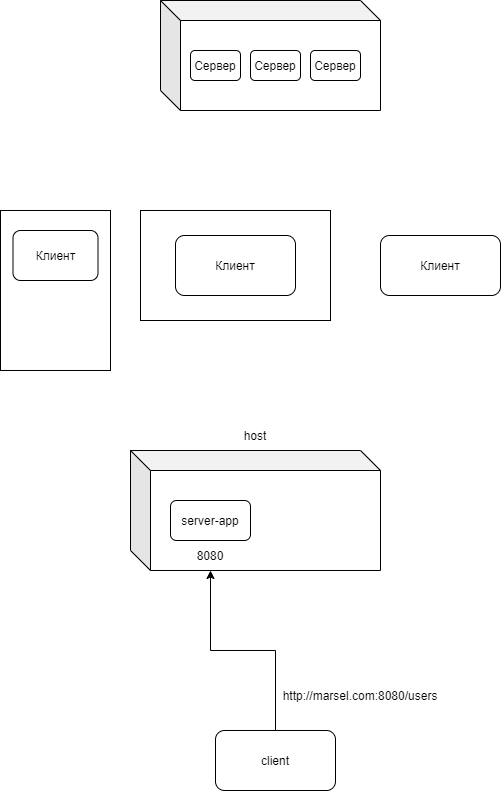

# 5.1

 

## HTTP

* HTTP - протокол передачи гипертекста.

* Протокол клиент-серверного взаимодействия. Подразумевает отправку запросов клиентом, и получение ответов от сервера.

### HTTP-запрос

* Метод запроса: `GET` - для получения данных с сервера, `POST` - для отправки данных с клиента на сервер с передачей информации в теле запроса.

* URL

```
[протокол]://[host-name/ip]:[port]/[resource-name]?param1=value1&param2=value2...
```

```
https://www.google.com/search?q=python
```

* Параметры запроса: `q=python`

* Заголовки запроса (`headers`), `content-type` (показывает тип содержимого, которое мы направляем на сервер, например - `application/x-www-form-urlencoded`).

* `cookie` - информация, которую направляет браузер с каждым запросом клиента на сервер.

* Тело запроса (только для `POST`).


### HTTP-ответ

* Статус ответа - 200 OK, 404 Not Found, 500 Internal Server Error

* Тело ответа - HTML-страница, изображение, аудио-видео, файл

* Заголовки ответа - `Content-Type` - тип содержимого, `Content-Length` - размер содержимого. `Set-Cookie` - позволяет задать Cookie для браузера, чтобы потом отправлять эту информацию на этот домен с каждым последующим запросом.