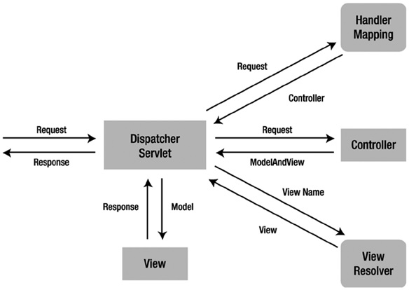

# 7.3

## Spring MVC

* `DispatcherServlet` - обрабатывает все входящие запросы, имеет привязку к контексту Spring.
* `HandlerMappging` - определяет, какой именно обработчик будет работать с конкретным запросом.
* `BeanNameUrlHandlerMapping` - определяет нужный обработчик по id-бина-обработчика.
* `Controller` - объект, который выполняет непосредственную обработку запроса.
* `ModelAndView` - объект, который содержит название представления и данные, которые необходимо вывести.
* `ViewResolver` - компонент, определяющий конкретный файл представления по его названию.