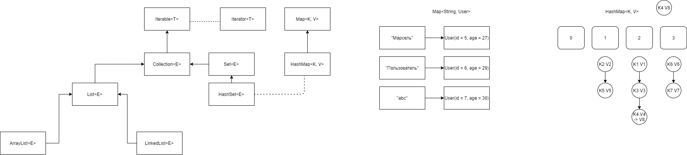

# 1.4

## Collections

* `Iterable<T>` - если класс реализует данный интерфейс, значит его элементы можно "перебрать" в for-each.

* `Iterator<T>` - курсор по какой-либо коллекции. 

* `Collection<T>` - коллекция элементов. Не гарантирует никакого порядка хранения.

```
boolean add(E e);
boolean contains(Object o);
```

* `List<T>` - список, гарантирует порядок элементов.

```
E get(int index);
```

* `ArrayList<E>` - список на основе массива. В случае переполнения создает копию исходного массива, большего 
предыдущего в полтора раза и копирует туда старые данные. (`static native void arraycopy`).

* `LinkedList<E>` - список на основе узлов (двусвязный список). Добавление элемента заключается в простом присоединении
нового элемента в качестве последнего. Получение элемента по индексу достаточно тяжеловесная операция. Несмотря на то,
что идем либо с конца, либо с начала.

* `Map<K, V>` - ассоциативный массив, гарантирующий уникальность ключей и при этом представляющий собой
отображение между ключами и значениями любых типов.

* `HashMap<K, V>` - реализация `Map<K,V` на основе хеш-таблицы.

* Хеш-функция - преобразование одной последовательности бит в другую последовательность. В Java
используется для реализации `HashMap`. Поскольку ключи могут быть совершенно разных типов, а нам необходимо
определить в какой элемент массива нужно положить пару ключ-значение - надо преобразовать ключ в индекс массива, 
т.е. в число. Поэтому, в классе `Object` есть метод `hashCode`, который как раз позволяет реализовать хеш-функцию 
для любого объектов любого класса.

* Как реализовать хеш-фукнцию? Для строк она реализована следующим образом:
берется каждая буква, ее код умножается на 31^(n - позиция этой буквы) и складывается с остальными значениями.

* Коллизия - поскольку размер массива в Java ограничен максимальным значением `int`, то и `hashCode`
возвращает значение в диапазоне `int`. Поскольку потенциальное количество объектов больше, чем
количество int-ов, то будут ситуации, когда разным объектам соответствует один и тот же `hashCode`.
Но, мы хотим, чтобы коллизий было меньше, следовательно, мы не просто суммируем элементы для вычисления хеш-кода,
а мы домножаем их на простые числа. 

* Важно! Для каждого вашего класса, который потенциально будет использоваться в `HashMap` необходимо 
переопределить `equals` и `hashCode` одновременно. Причем так, чтобы в `equals` участвовало не меньше полей, чем в `hashCode`.
Чтобы избежать ситуации, когда объекты по `equals` равны, а по хеш-коду - нет.

