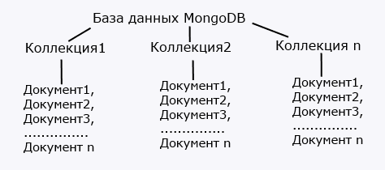
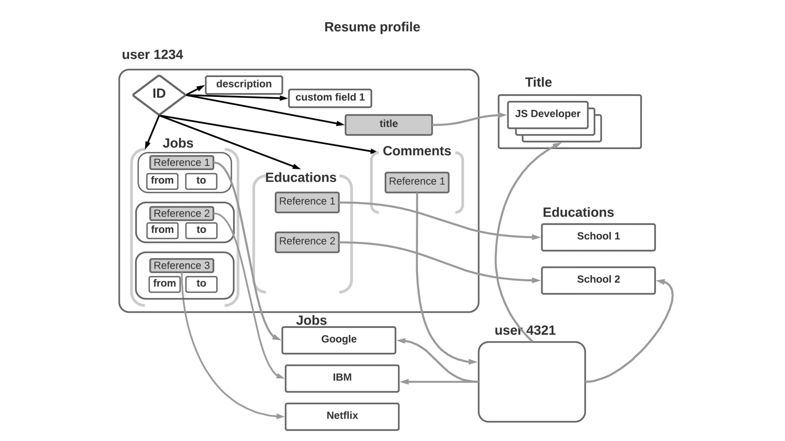

# MongoDB





```
db.courses.insertOne(
    {
        title: 'Введение в разработку на Java',
        studentsCount: 26,
        hours: 72,
        active: true,
        keywords: ['java', 'java core', 'oop'],
        description: 'Отлично подойдет для новичков!'
    });

db.courses.insertMany(
    [
        {
            title: 'Инструменты разработки на Java',
            studentsCount: 15,
            hours: 36,
            active: true,
            keywords: ['java', 'java core', 'maven', 'junit', 'mockito'],
            feedbacks: ['неплохой курс!', 'отличный преподаватель!']
        },
        {
            title: 'Java Servlet API',
            studentsCount: 10,
            hours: 36,
            active: false,
            keywords: ['java', 'java ee', 'servlet', 'http', 'ajax'],
            rating: 9.8
        },
        {
            title: 'REST API',
            state: 'draft',
            active: false,
            keywords: ['java', 'java ee', 'servlet', 'http', 'ajax', 'api', 'rest'],
        }
    ]
    );

db.courses.find({keywords: 'java core'});

db.courses.find({$or: [{studentsCount: {$lt: 35}}, {keywords: 'java core'}]});

db.courses.find({_id: ObjectId('619e0d8f05a5a10a47e5f9dc')});

db.courses.find({hours: {$exists: true}});

db.courses.find({hours: {$exists: true}}, {keywords: 1, _id: 0});

db.courses.find({hours: {$exists: true}}, {keywords: 1, _id: 0, hours: 1, studentsCount: 1})
    .sort({hours: -1, studentsCount: 1});

db.courses.updateOne({title: 'REST API'}, {$set: {progress: 22}});
db.courses.updateOne({title: 'REST API'}, {$inc: {progress: 1}});
db.courses.updateOne({title: 'REST API'}, {$push: {keywords: 'rest template'}});

// embedded
db.courses.updateOne({title: 'REST API'}, {$set:
        {
            mentor:
                {
                    firstName: 'Олег',
                    lastName: 'Игонин'
                }
        }
});

db.teachers.insertOne({
    name: 'Марсель Сидиков',
    experience: 10
});

db.teachers.insertOne({
    name: 'Александр Федоров',
    experience: 30
});

db.courses.updateOne({title: 'REST API'}, {$set:
        {
            lead: ObjectId('619e1334ab76eb623b2efe98'),
            helper: ObjectId('619e1322ab76eb623b2efe96')
        }
})
```