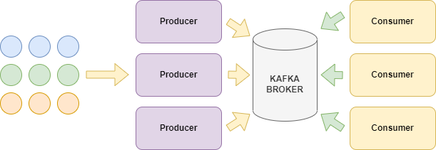

# Kafka - структура хранения сообщений

## Хранение сообщений

* `/logs`

	* `.log` 
		- offset - номер сообщения (0 .. n-1)
		- position - байт с которого начинается сообщение
		- timestamp - время сообщения
		- message

		```
		...
		34 5432 ... Hello!
		```

	* `.index` - отображение offset на position

		```
		34 -> 5432
		```

	* `.timeindex` - отображение timestamp на position

## Получение сообщений

* `consumer_offsets` - отдельный topic, который хранит информацию, какое сообщение было прочитано конкретной группой consumer-ов в конкретном топике.

```
topic
group
offset
position
...
```





