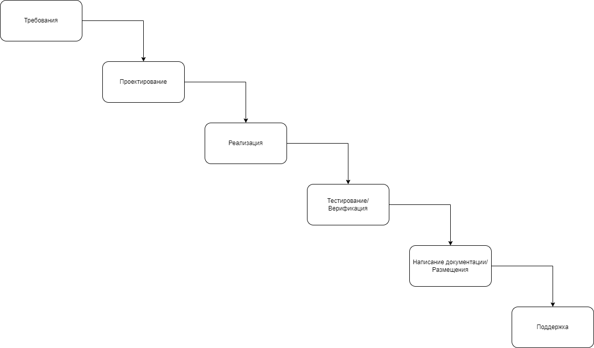

## Методологии разработки

### Waterfall

* Подходит для гос. заказов и крупных проектов

#### Плюсы

- Спланированный бюджет и сроки

#### Минусы

- Отсутствие гибкости и бюрократия

### Agile

* Подходит для стартапов
* Итерация (планирование, разработка, тестирование, анализ и т.д.)

#### Плюсы

- Максимальная гибкость
- Тесное взаимодействие с заказчиком

#### Минусы

- Чрезмерная гибкость, которая приводит к понижению качества кодовой базы
- Отсутствие документации
- Можем получить только MVP

### SCRUM

* Фреймворк-реализация Agile

* Все задачи уходят в Backlog (содержит User Stories)
* `Спринт` - от 2-х недель до 2-х месяцев. Каждый спринт тщательно планируется.
* В рамках спринта мы делаем инкремент продукта.
* Во время спринта ничего в требования добавлять нельзя.
* Ежедневные встречи - что получилось, что не получилось, какие проблемы.
* В конце спринта - ретроспектива.

* SCRUM Master - участвует в планировании спринта и следит, чтобы правила SCRUM не нарушались.

* Product Owner - представитель заказчика, участвует в разработке продукта.

## Техническое задание

* Лист согласования
* Оглавление
* ТЕРМИНЫ, ОПРЕДЕЛЕНИЯ И СОКРАЩЕНИЯ
* ОБЩИЕ СВЕДЕНИЯ
	* Наименование системы
	* Назначение
	* Цель внедрения
* ОГРАНИЧЕНИЯ И ДОПУЩЕНИЯ
* ФУНКЦИОНАЛЬНЫЕ ТРЕБОВАНИЯ
	* Модуль 1
	* Модуль 2 
	* ...
* ТРЕБОВАНИЯ К ИНФОРМАЦИОННОЙ И ПРОГРАММНОЙ СОВМЕСТИМОСТИ
* ТРЕБОВАНИЯ К ПРОИЗВОДИТЕЛЬНОСТИ
* ТРЕБОВАНИЯ К ДОКУМЕНТАЦИИ
* ПОРЯДОК И КРИТЕРИИ ПРИЕМКИ

## UML

* [Activity](img/uml_activity.pdf)
* [Sequence](img/uml_seq.pdf)
* [States](img/uml_states.pdf)
* [Use case](img/uml_use_case.pdf)