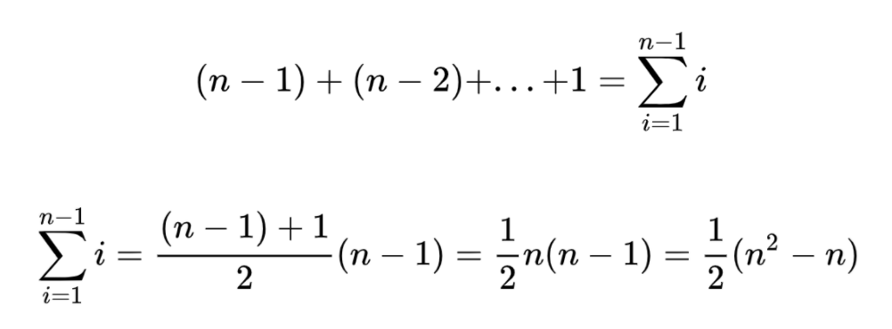
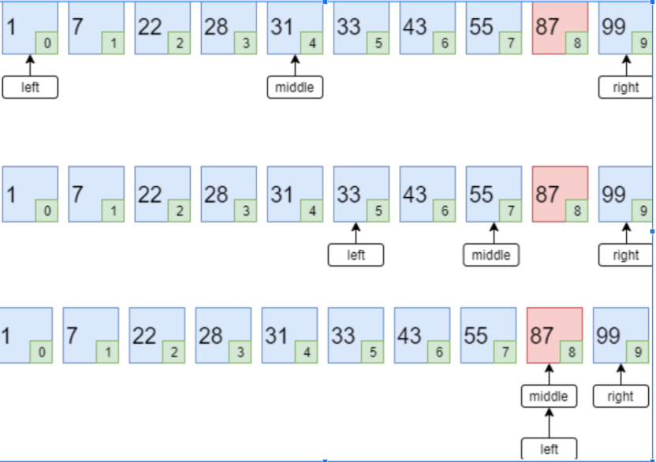
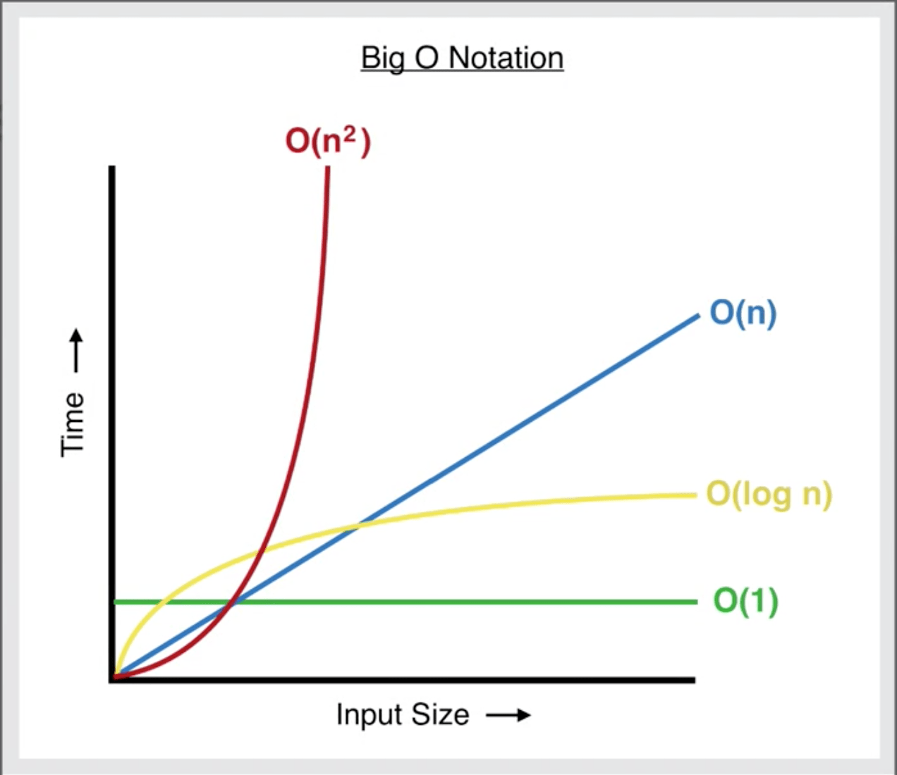

# Алгоритмы и их оценка

## Сортировка выбором

* Всегда находим самый минимальный элемент в просматриваемом диапазоне `[i...n-1]`.
* Далее, ставим его в позицию `i`.

## Бинарный поиск

## Оценки сложности алгоритмов

* Критерии оценивания:
  - Скорость работы (время в секундах) - не устраивает (разная скорость у разных компьютеров)
  - Количество операций в зависимости от входных данных - не устраивает (очень много разных формул будет)

* Асимптотическая сложность - что количество(скорость) операций не превышает какое-то заданное значение.

* Сложность алгоритма сортировки выбором - 1/2(n^2 - n), но это всегда меньше, чем n^2, но при этом растет с такой
же скоростью -> сложность сортировки выбором O(n^2) - квадратичная сложность.

* Сложность бинарного поиска:

- Пусть в массиве 128 элементов. -> 2^7
1) Ищем в диапазоне 64 элемента
2) Ищем в диапазоне 32 элемента
3) Ищем в диапазоне 16 элементов
4) Ищем в диапазоне 8 элементов
5) Ищем в диапазоне 4 элемента
6) Ищем в диапазоне 2 элемента
7) Ищем в диапазоне 1 элемент

Сколько операций? - 7 штук.

Следовательно:

---

